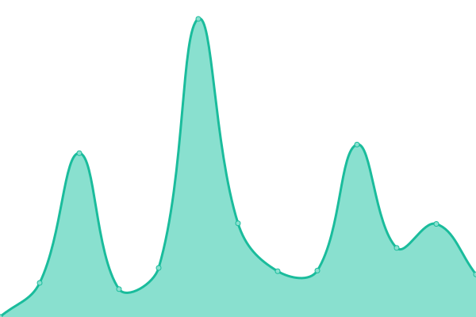
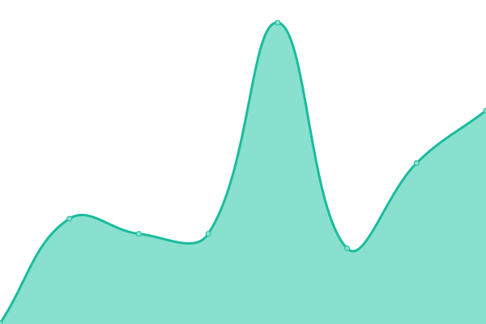

# [📈 Live Status](https://parables.github.io/upptime-tembo): <!--live status--> **🟩 All systems operational**

This repository contains the open-source uptime monitor and status page for [Parables Boltnoel](https://parables.github.io/upptime-tembo), powered by [Upptime](https://github.com/upptime/upptime).

With [Upptime](https://upptime.js.org), you can get your own unlimited and free uptime monitor and status page, powered entirely by a GitHub repository. We use [Issues](https://github.com/parables/upptime-tembo/issues) as incident reports, [Actions](https://github.com/parables/upptime-tembo/actions) as uptime monitors, and [Pages](https://parables.github.io/upptime-tembo) for the status page.

<!--start: status pages-->
<!-- This summary is generated by Upptime (https://github.com/upptime/upptime) -->
<!-- Do not edit this manually, your changes will be overwritten -->
<!-- prettier-ignore -->
| URL | Status | History | Response Time | Uptime |
| --- | ------ | ------- | ------------- | ------ |
|  [Tembo](https://boppeccu.csinformationsys.com/) | 🟩 Up | [tembo.yml](https://github.com/Parables/upptime-tembo/commits/HEAD/history/tembo.yml) | 

 1103ms
     
 | 

<a href="https://parables.github.io/upptime-tembo/history/tembo">94.75%</a>
    

|  [BOSS](https://boss.boppccu.com) | 🟩 Up | [boss.yml](https://github.com/Parables/upptime-tembo/commits/HEAD/history/boss.yml) | 

 1606ms
     
 | 

<a href="https://parables.github.io/upptime-tembo/history/boss">100.00%</a>
    

|  [BOPPCCU](https://boppccu.com) | 🟩 Up | [boppccu.yml](https://github.com/Parables/upptime-tembo/commits/HEAD/history/boppccu.yml) | 

 1174ms
     
 | 

<a href="https://parables.github.io/upptime-tembo/history/boppccu">97.40%</a>
    

|  [BOPPCCU Mail](https://mail.boppccu.com) | 🟩 Up | [boppccu-mail.yml](https://github.com/Parables/upptime-tembo/commits/HEAD/history/boppccu-mail.yml) | 

 619ms
     
 | 

<a href="https://parables.github.io/upptime-tembo/history/boppccu-mail">100.00%</a>
    

|  [CUBE](https://cube.boppccu.com) | 🟩 Up | [cube.yml](https://github.com/Parables/upptime-tembo/commits/HEAD/history/cube.yml) | 

 318ms
     
 | 

<a href="https://parables.github.io/upptime-tembo/history/cube">100.00%</a>
    

<!--end: status pages-->

[**Visit our status website →**](https://parables.github.io/upptime-tembo)

## 📄 License

- Powered by: [Upptime](https://github.com/upptime/upptime)
- Code: [MIT](./LICENSE) © [Anand Chowdhary](https://anandchowdhary.com), supported by [Pabio](https://pabio.com)
- Data in the `./history` directory: [Open Database License](https://opendatacommons.org/licenses/odbl/1-0/)
